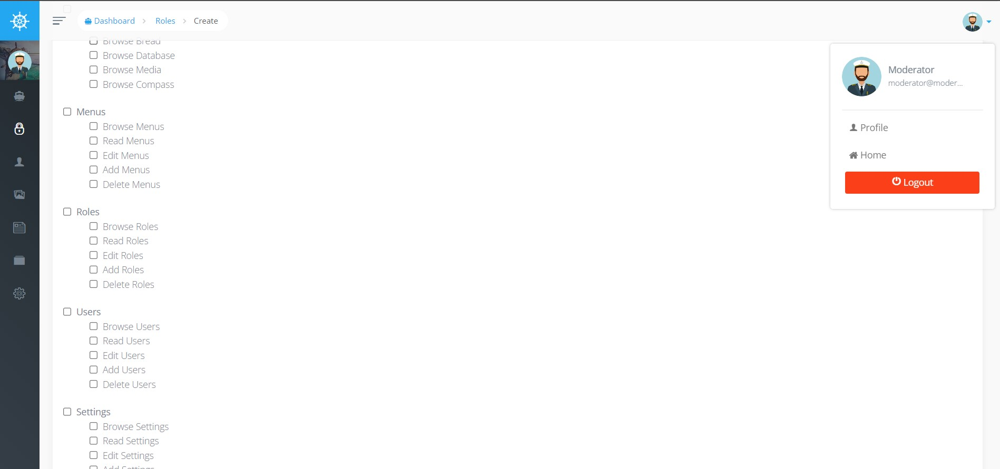
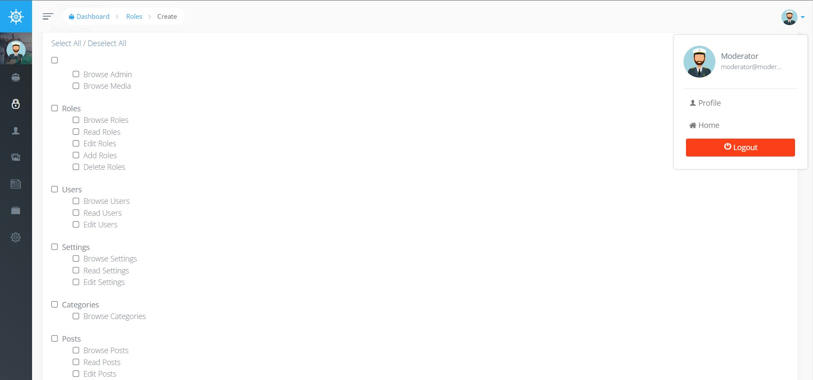

## Voyager CO-Admin

### Description

The **"voyager-co-admin"** package is designed specifically for the **Laravel Voyager Admin Panel 1.6**. It enhances the functionality by displaying the permissions granted by the superuser (root or admin) in the Voyager Admin Panel. With this package, if certain roles are given the permissions to create and assign roles, they will be able to grant the same permissions to other roles that they themselves possess.

By utilizing **"voyager-co-admin"**, administrators can have granular control over role management within the Voyager Admin Panel. The package enables a hierarchical role structure where designated roles with the appropriate permissions can create and assign roles to other users, ensuring the seamless delegation of access privileges.

## Installation


> #### Requirement
> Laravel: v8+ or v9+  
> Voyager: v1.6+  
> You should fully install the package [Voyager](https://github.com/the-control-group/voyager) before.
---

1. Install the package via composer:
    ```bash
    composer require sweet1s/voyager-co-admin
    ```
2. Publish the package's assets:
    ```bash
    php artisan vendor:publish --provider="Sweet1s\VoyagerCoAdmin\Providers\VoyagerCoAdminServiceProvider"
    ```
   

## Before

In the regular usage of Voyager Admin Panel, when creating a role with limited capabilities, the role will still be able to see all existing permissions.



## After

With the **"voyager-co-admin"** package, the role will only be able to see the permissions that they themselves possess.




